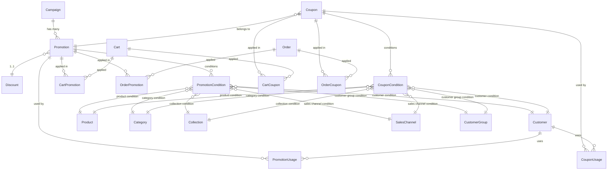

```mermaid
erDiagram

    Campaign ||--o{ Promotion : "has many"
    Promotion }o--|| Discount : "1..1"
    Promotion ||--o{ PromotionCondition : "conditions"
    Promotion ||--o{ PromotionUsage : "used by"
    Promotion ||--o{ CartPromotion : "applied in"
    Promotion ||--o{ OrderPromotion : "applied in"

    Coupon ||--o{ CouponCondition : "conditions"
    Coupon ||--o{ CouponUsage : "used by"
    Coupon ||--o{ CartCoupon : "applied in"
    Coupon ||--o{ OrderCoupon : "applied in"
    Coupon }o--|| Promotion : "belongs to"

    Customer ||--o{ CouponUsage : "uses"
    Customer ||--o{ PromotionUsage : "uses"

    PromotionCondition }o--|| Product : "product condition"
    PromotionCondition }o--|| Category : "category condition"
    PromotionCondition }o--|| Collection : "collection condition"
    PromotionCondition }o--|| SalesChannel : "sales channel condition"
    PromotionCondition }o--|| CustomerGroup : "customer group condition"
    PromotionCondition }o--|| Customer : "customer condition"

    CouponCondition }o--|| Product : "product condition"
    CouponCondition }o--|| Category : "category condition"
    CouponCondition }o--|| Collection : "collection condition"
    CouponCondition }o--|| SalesChannel : "sales channel condition"
    CouponCondition }o--|| CustomerGroup : "customer group condition"
    CouponCondition }o--|| Customer : "customer condition"

    Cart ||--o{ CartPromotion : "applied"
    Cart ||--o{ CartCoupon : "applied"

    Order ||--o{ OrderPromotion : "applied"
    Order ||--o{ OrderCoupon : "applied"
```

