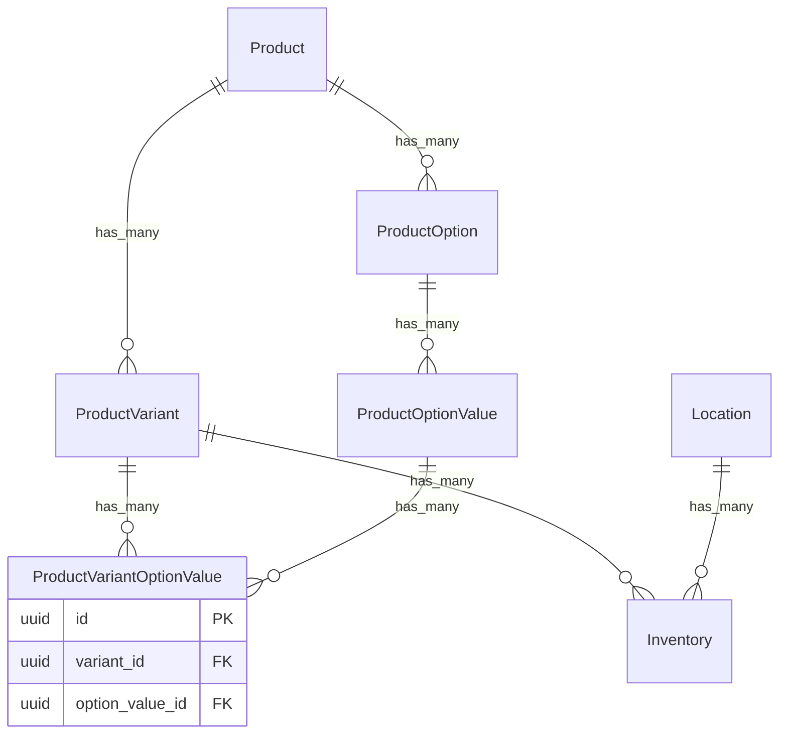

---

## 🏗 ER Diagram (нэмэлттэй)



---

## 📦 Жишээ өгөгдөл

### Product

```json
{
  "id": "prod_tshirt",
  "title": "Unisex T-Shirt",
  "sku": "TSHIRT-BASE",
  "base_price": 20000
}
```

### ProductOption

```json
[
  { "id": "opt_size", "product_id": "prod_tshirt", "name": "Size" },
  { "id": "opt_color", "product_id": "prod_tshirt", "name": "Color" }
]
```

### ProductOptionValue

```json
[
  { "id": "optval_s", "option_id": "opt_size", "value": "S" },
  { "id": "optval_m", "option_id": "opt_size", "value": "M" },
  { "id": "optval_l", "option_id": "opt_size", "value": "L" },
  { "id": "optval_red", "option_id": "opt_color", "value": "Red" },
  { "id": "optval_blue", "option_id": "opt_color", "value": "Blue" }
]
```

### ProductVariant

```json
[
  { "id": "var_s_red", "product_id": "prod_tshirt", "sku": "TSHIRT-S-RED", "price": 22000 },
  { "id": "var_m_red", "product_id": "prod_tshirt", "sku": "TSHIRT-M-RED", "price": 22000 },
  { "id": "var_l_blue", "product_id": "prod_tshirt", "sku": "TSHIRT-L-BLUE", "price": 22000 }
]
```

### ProductVariantOptionValue (variant ↔ option\_value mapping)

```json
[
  { "id": "vov1", "variant_id": "var_s_red", "option_value_id": "optval_s" },
  { "id": "vov2", "variant_id": "var_s_red", "option_value_id": "optval_red" },

  { "id": "vov3", "variant_id": "var_m_red", "option_value_id": "optval_m" },
  { "id": "vov4", "variant_id": "var_m_red", "option_value_id": "optval_red" },

  { "id": "vov5", "variant_id": "var_l_blue", "option_value_id": "optval_l" },
  { "id": "vov6", "variant_id": "var_l_blue", "option_value_id": "optval_blue" }
]
```

### Location

```json
[
  { "id": "loc_ub1", "name": "Ulaanbaatar Warehouse", "address": "Bayanzurkh, Ulaanbaatar" },
  { "id": "loc_erd", "name": "Erdenet Store", "address": "Erdenet city center" }
]
```

### Inventory

```json
[
  { "id": "inv1", "variant_id": "var_s_red", "location_id": "loc_ub1", "quantity": 50 },
  { "id": "inv2", "variant_id": "var_m_red", "location_id": "loc_ub1", "quantity": 30 },
  { "id": "inv3", "variant_id": "var_l_blue", "location_id": "loc_erd", "quantity": 20 }
]
```

---

## ✅ Дүгнэлт

* `ProductVariantOptionValue` join table → Variant бүрийг option value-тай **explicit** холбож өгнө.
* Ингэснээр систем яг ямар combination-аас variant бүр үүссэн гэдгийг бүрэн тодорхой харуулна.
* Жишээлбэл: `TSHIRT-M-RED` → `{ Size = M, Color = Red }`.

---

👉 Чи хүсвэл би үүнийг яг **PostgreSQL migration SQL** маягаар бичээд өгч болох уу (бүх FK-тай нь)?
