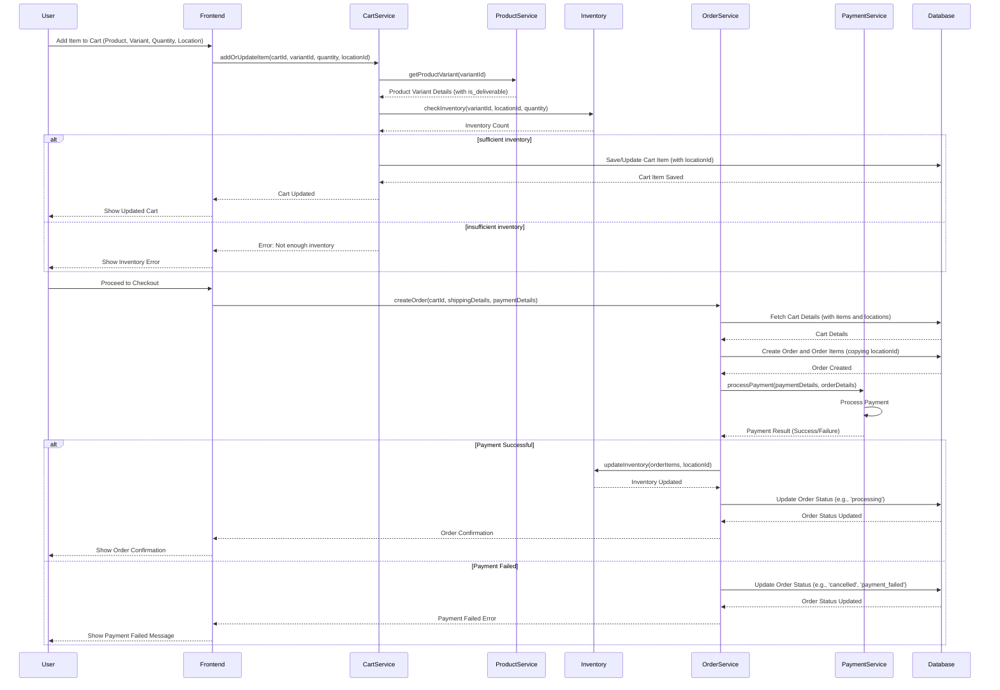

# E-commerce Purchase Flow Sequence Diagram

```mermaid
sequenceDiagram
    participant User
    participant Frontend
    participant CartService
    participant ProductService
    participant Inventory
    participant OrderService
    participant PaymentService
    participant Database

    User->>Frontend: Add Item to Cart (Product, Variant, Quantity, Location)
    Frontend->>CartService: addOrUpdateItem(cartId, variantId, quantity, locationId)
    CartService->>ProductService: getProductVariant(variantId)
    ProductService-->>CartService: Product Variant Details (with is_deliverable)
    CartService->>Inventory: checkInventory(variantId, locationId, quantity)
    Inventory-->>CartService: Inventory Count
    alt sufficient inventory
        CartService->>Database: Save/Update Cart Item (with locationId)
        Database-->>CartService: Cart Item Saved
        CartService-->>Frontend: Cart Updated
        Frontend-->>User: Show Updated Cart
    else insufficient inventory
        CartService-->>Frontend: Error: Not enough inventory
        Frontend-->>User: Show Inventory Error
    end

    User->>Frontend: Proceed to Checkout
    Frontend->>OrderService: createOrder(cartId, shippingDetails, paymentDetails)
    OrderService->>Database: Fetch Cart Details (with items and locations)
    Database-->>OrderService: Cart Details
    OrderService->>Database: Create Order and Order Items (copying locationId)
    Database-->>OrderService: Order Created
    OrderService->>PaymentService: processPayment(paymentDetails, orderDetails)
    PaymentService->>PaymentService: Process Payment
    PaymentService-->>OrderService: Payment Result (Success/Failure)

    alt Payment Successful
        OrderService->>Inventory: updateInventory(orderItems, locationId)
        Inventory-->>OrderService: Inventory Updated
        OrderService->>Database: Update Order Status (e.g., 'processing')
        Database-->>OrderService: Order Status Updated
        OrderService-->>Frontend: Order Confirmation
        Frontend-->>User: Show Order Confirmation
    else Payment Failed
        OrderService->>Database: Update Order Status (e.g., 'cancelled', 'payment_failed')
        Database-->>OrderService: Order Status Updated
        OrderService-->>Frontend: Payment Failed Error
        Frontend-->>User: Show Payment Failed Message
    end
```